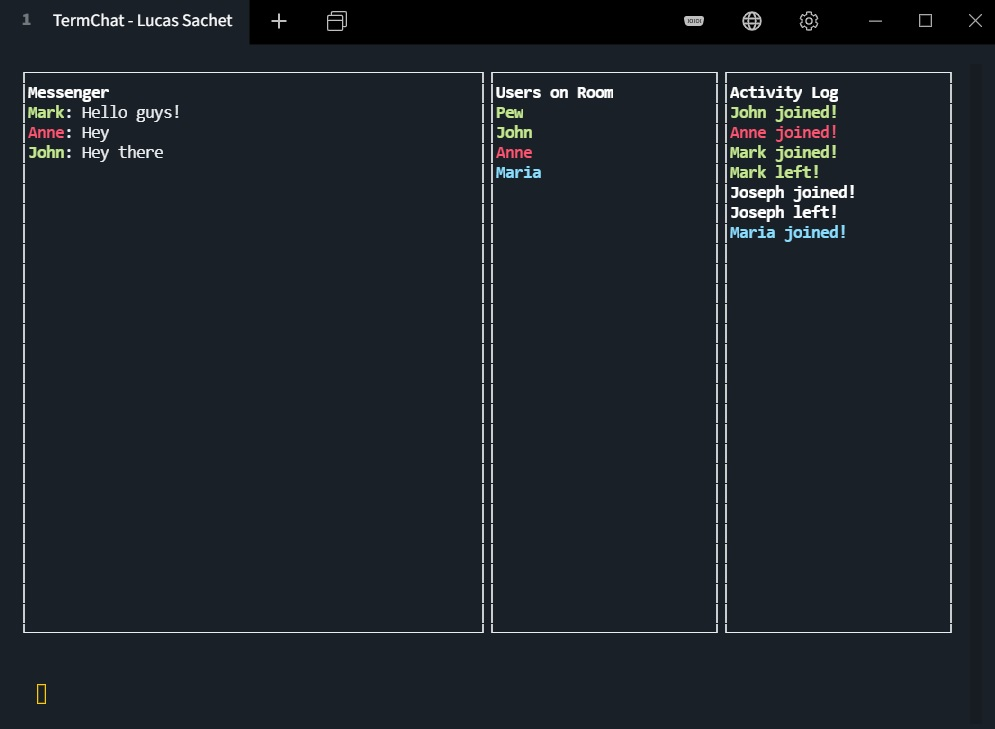

<!-- PROJECT SHIELDS -->
<!--
*** I'm using markdown "reference style" links for readability.
*** See the bottom of this document for the declaration of the reference variables
*** https://www.markdownguide.org/basic-syntax/#reference-style-links
-->

[![Contributors][contributors-shield]][contributors-url]
[![Forks][forks-shield]][forks-url]
[![Stargazers][stars-shield]][stars-url]
[![Issues][issues-shield]][issues-url]
[![MIT License][license-shield]][license-url]
[![LinkedIn][linkedin-shield]][linkedin-url]


<!-- PROJECT LOGO -->
<br />

 
<h3 align="center">Chat-On-Terminal</h3>
<p align="center">
  
</p>
  <p align="center">
    An awesome README template to jumpstart your projects!
    <br />
    <a href="https://github.com/lucas-sachet/Chat-On-Terminal"><strong>Explore the docs »</strong></a>
    <br />
    <br />
    <a href="https://github.com/lucas-sachet/Chat-On-Terminal/issues">Report Bug</a>
    ·
    <a href="https://github.com/lucas-sachet/Chat-On-Terminal/issues">Request Feature</a>
  </p>


<!-- TABLE OF CONTENTS -->
<details open="open">
  <summary>Table of Contents</summary>
  <ol>
    <li>
      <a href="#about-the-project">About The Project</a>
    </li>
    <li>
      <a href="#getting-started">Getting Started</a>
      <ul>
        <li><a href="#prerequisites">Prerequisites</a></li>
        <li><a href="#installation">Installation</a></li>
      </ul>
    </li>
    <li><a href="#usage">Usage</a></li>
    <li><a href="#roadmap">Roadmap</a></li>
    <li><a href="#contributing">Contributing</a></li>
    <li><a href="#license">License</a></li>
    <li><a href="#contact">Contact</a></li>
  </ol>
</details>


<!-- ABOUT THE PROJECT -->
## About The Project

This is program that creating interfaces in command line programs with the Blessed package, resuming it is a chat that runs on OS terminal
* It is working with HTTP Sockets and Event-Oriented Architecture
* Update online activity, messaging and user data in real time
* Links events between the command line program and the Web Socket server. You will get events from customers who have just entered the chat room,
customers who have left and mainly record each of these events.
* Establishes the connection between multi-users in the chat between different rooms for different users.

<!--### Built With

***This section should list any major frameworks that you built your project using. Leave any add-ons/plugins for the acknowledgements section. Here are a few examples.
***[Bootstrap](https://getbootstrap.com)
-->


<!-- GETTING STARTED -->
## Getting Started

To get a local copy up and running follow these simple example steps.

### Prerequisites

You need the following to be installed in order to make everything work

* npm
  ```sh
  npm install npm@latest -g
  ```
* node `version  15.+`
 [NODEJS](https://nodejs.org/en/download/)

### Installation

1. Clone the repo
   ```sh
   git clone https://github.com/lucas-sachet/Chat-On-Terminal.git
   ```
2. Install NPM packages in both server and client sides
   ```sh
   npm install
   ```


<!-- USAGE EXAMPLES -->
## Usage

If you want to use this on localhost you can go to the package.json under `scripts` and add your own user like this :
```sh
node index.js --username yourusername  --room yourroom  --hostUri http://localhost:PORT
```

You can add as many users on different rooms to test it out.

After adding users you need to start the server: 
```sh
cd server
```
and run:
```sh
npm run dev
```

Then you start loggin the users this way:
```sh
cd client
```
and run (here you must use the user name you passed in --username):
```sh
npm run yourusername
```


<!-- ROADMAP -->
## Roadmap

See the [open issues](https://github.com/othneildrew/Best-README-Template/issues) for a list of proposed features (and known issues).


<!-- CONTRIBUTING -->
## Contributing

Contributions are what make the open source community such an amazing place to be learn, inspire, and create. Any contributions you make are **greatly appreciated**.

1. Fork the Project
2. Create your Feature Branch (`git checkout -b feature/AmazingFeature`)
3. Commit your Changes (`git commit -m 'Add some AmazingFeature'`)
4. Push to the Branch (`git push origin feature/AmazingFeature`)
5. Open a Pull Request


<!-- LICENSE -->
## License

Distributed under the MIT License. See `LICENSE` for more information.


<!-- CONTACT -->
## Contact

Lucas Sachet - lucasachet@gmail.com

Project Link: [Chat-On-Terminal](https://github.com/lucas-sachet/Chat-On-Terminal)


<!-- MARKDOWN LINKS & IMAGES -->
<!-- https://www.markdownguide.org/basic-syntax/#reference-style-links -->
[contributors-shield]: https://img.shields.io/github/contributors/lucas-sachet/Chat-On-Terminal
[contributors-url]: https://github.com/lucas-sachet/Chat-On-Terminal/graphs/contributors
[forks-shield]: https://img.shields.io/github/forks/lucas-sachet/Chat-On-Terminal?style=social
[forks-url]: https://github.com/lucas-sachet/Chat-On-Terminal/network/members
[stars-shield]: https://img.shields.io/github/stars/lucas-sachet/Chat-On-Terminal?style=social
[stars-url]: https://github.com/lucas-sachet/Chat-On-Terminal/stargazers
[issues-shield]: https://img.shields.io/github/issues/lucas-sachet/Chat-On-Terminal
[issues-url]: https://github.com/lucas-sachet/Chat-On-Terminal/issues
[license-shield]: https://img.shields.io/github/license/lucas-sachet/Chat-On-Terminal
[license-url]: https://github.com/lucas-sachet/Chat-On-Terminal/blob/master/LICENSE
[linkedin-shield]: https://img.shields.io/badge/-LinkedIn-black.svg?style=flat&&logo=linkedin&colorB=555
[linkedin-url]: https://www.linkedin.com/in/lucas-sachet/
